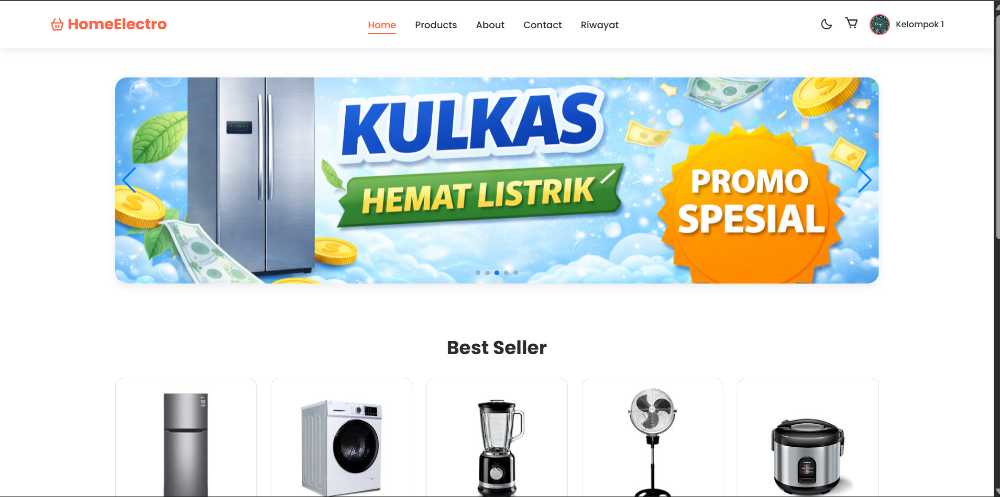
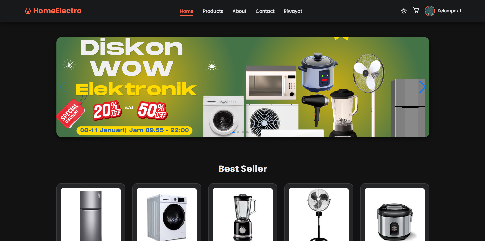
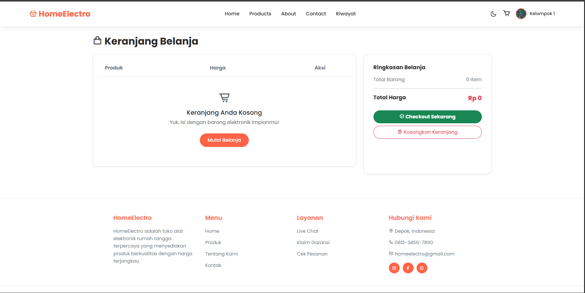
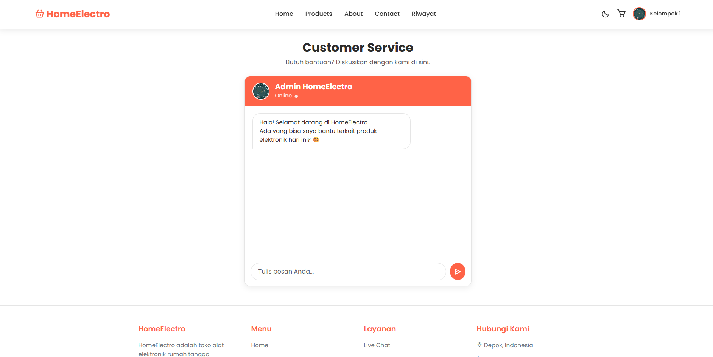
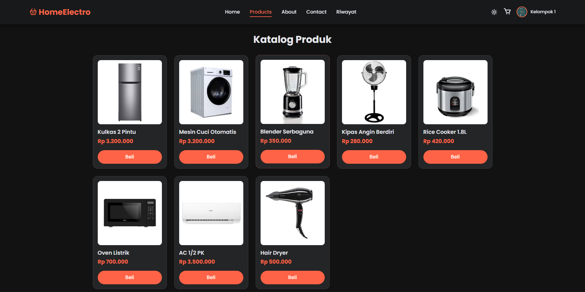
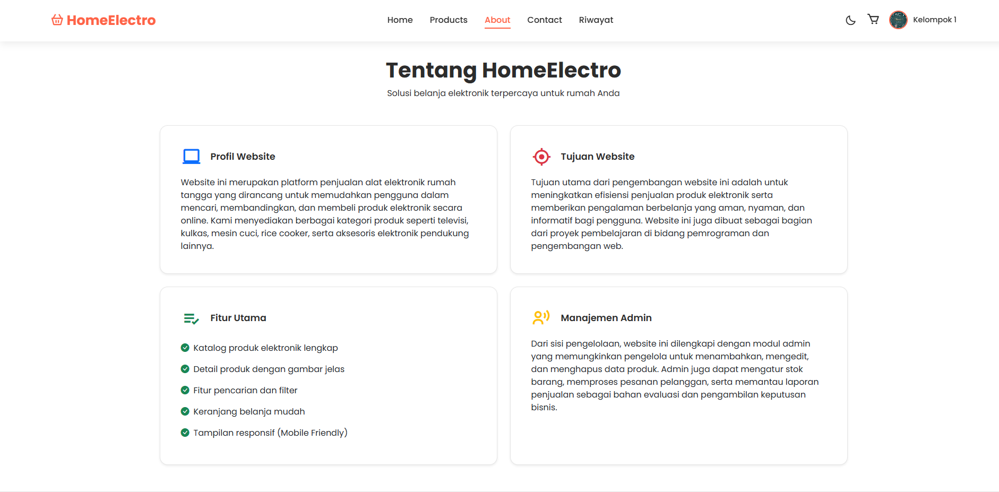
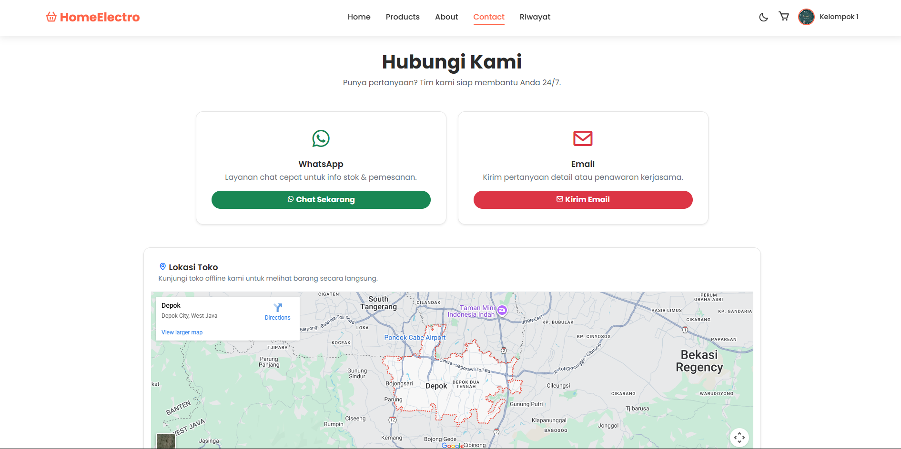
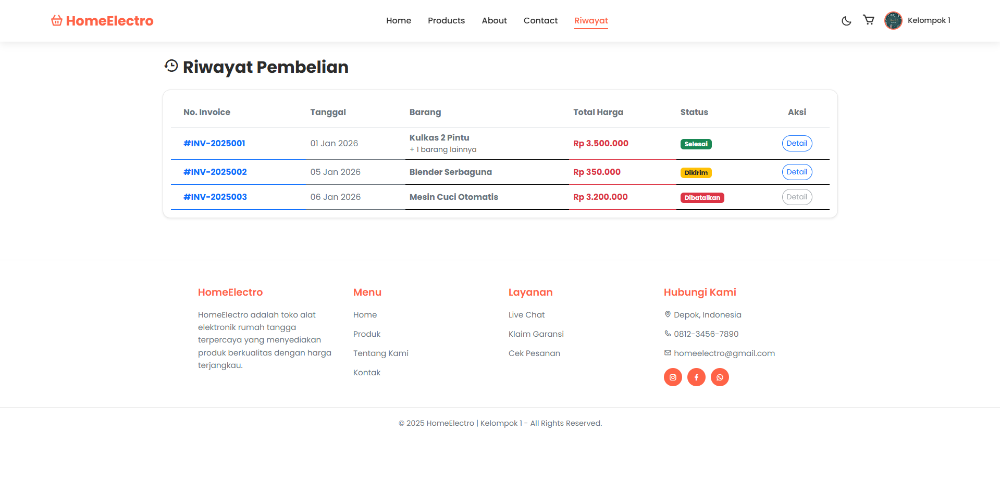

# 🛒 HomeElectro - Toko Alat Elektronik Rumah

**HomeElectro** adalah website e-commerce responsif yang dirancang untuk penjualan alat elektronik rumah tangga. Proyek ini dibuat sebagai tugas akhir mata kuliah **Dasar-Dasar Pemrograman (DDP)** / Pengembangan Web.

Website ini memiliki fitur lengkap mulai dari katalog produk, keranjang belanja yang menyimpan data (Local Storage), simulasi chat bot, hingga fitur Dark Mode yang modern.

---

## 👥 Daftar Anggota Kelompok 1

| No | Nama Anggota | NIM |
| :---: | :--- | :--- |
| 1 | **Muhammad Ibrahim** | 0110125042 |
| 2 | **Nayla Ibnati Qonitha** | 0110125045 |
| 3 | **Afipah Nabila** | 0110125016 |
| 4 | **Selviya Nurhuda** | 0110125064 |
---

## 📝 Deskripsi Website

Website ini bertujuan untuk memberikan pengalaman belanja online yang mudah dan interaktif. Pengguna dapat melihat detail produk, menambahkannya ke keranjang, dan melakukan simulasi checkout. 

Desain antarmuka (UI) dibuat **responsif** (cocok untuk HP & Laptop) dan **user-friendly**, dengan navigasi yang stabil (Sticky Navbar) dan transisi yang halus.

---

## ✨ Daftar Fitur Utama

### 1. 🎨 Tampilan & UX
- **Responsive Design:** Tampilan menyesuaikan layar HP, Tablet, dan Desktop.
- **Dark Mode / Light Mode:** Pengguna bisa mengganti tema pencahayaan sesuai kenyamanan mata (disimpan di browser).
- **Sticky Navbar:** Menu navigasi tetap terlihat saat di-scroll.
- **Slider Banner:** Banner promosi interaktif di halaman utama.

### 2. 🛍️ Fungsionalitas Belanja
- **Katalog Produk:** Grid layout yang rapi untuk menampilkan barang.
- **Detail Produk Dinamis:** Halaman detail yang menangkap data produk (Gambar, Harga, Deskripsi) dari halaman utama.
- **Keranjang Belanja (Smart Cart):**
  - Data barang tersimpan di **Local Storage** (tidak hilang saat di-refresh).
  - Menghitung total harga otomatis.
  - Fitur hapus per item atau hapus semua.
  - Badge notifikasi jumlah barang di navbar.

### 3. 💬 Interaksi & Simulasi
- **Live Chat Bot:** Simulasi chat dengan admin yang membalas otomatis berdasarkan kata kunci (contoh: "halo", "harga", "stok").
- **Simulasi Login:** Form login dengan validasi sederhana dan efek loading.
- **Simulasi Checkout:** Notifikasi sukses pembelian menggunakan animasi SweetAlert.

### 4. 📄 Halaman Pendukung
- **Riwayat Pesanan:** Tabel status pesanan (Dikirim, Selesai, Dibatalkan).
- **Garansi:** Informasi klaim garansi dan prosedur retur.
- **Kontak:** Link langsung ke WhatsApp dan Email.

---

## 🛠️ Teknologi yang Digunakan

Proyek ini dibangun menggunakan teknologi web standar tanpa framework backend (Client-Side Only).

* **HTML5:** Struktur semantik halaman web.
* **CSS3:** Styling custom, CSS Variables (untuk Dark Mode), dan Layout Grid/Flexbox.
* **JavaScript (Vanilla ES6):** Logika keranjang, DOM Manipulation, dan interaktivitas.
* **Bootstrap 5.3:** Framework CSS untuk layout responsif dan komponen UI.
* **SweetAlert2:** Library untuk pop-up alert yang cantik.
* **SwiperJS:** Library untuk slider banner yang responsif.
* **Boxicons:** Ikon vektor modern.

---

## 📸 Screenshot Tampilan

### 1. Halaman Utama (Home)

### 2. Dark Mode

### 3. Keranjang Belanja

### 4. Live Chat

### 5. gambar lain nya 

